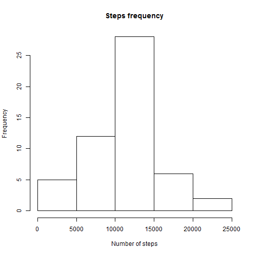
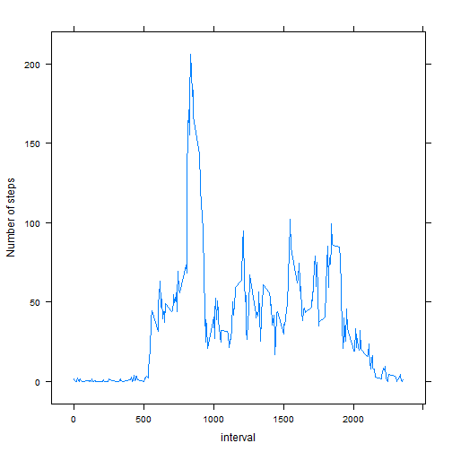
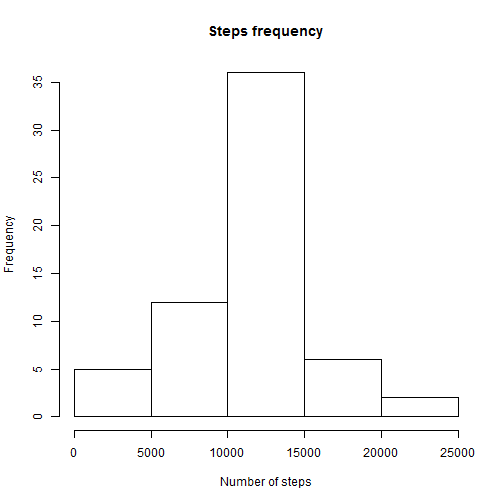

## Loading and preprocessing the data
Loading source file , adding library that we neeed for ploating. 

```r
library(lattice)
#put source file into your working directory
data<-read.csv("activity.csv")
data$steps <- as.numeric(data$steps)
data$date <- as.Date(data$date)
data$interval <- as.numeric(data$interval)
```


## What is mean total number of steps taken per day?
Ignore rows where steps equal to 'NA'


```r
dataWithoutNA <- na.omit(data)
Day_SUMMARY <- aggregate(steps ~ date, dataWithoutNA, sum)
names(Day_SUMMARY) = c("date","steps_count")
```

Here is histogram:


```r
# Histogram of the total number of steps taken each day
hist(Day_SUMMARY$steps_count, xlab = "Number of steps",main = "Steps frequency")
```

 

Code for mean and median:


```r
mean(Day_SUMMARY$steps_count)
```

```
## [1] 10766.19
```

```r
median(Day_SUMMARY$steps_count)
```

```
## [1] 10765
```


## What is the average daily activity pattern?
You can see daily activity pattern on the picture below:


```r
Interval_SUMMARY <- aggregate(steps ~ interval, dataWithoutNA, mean)
xyplot(steps ~ interval, data = Interval_SUMMARY, type = "l", ylab = "Number of steps")
```

 


```r
Max_Steps_Interval <- Interval_SUMMARY[which.max(Interval_SUMMARY$steps),1]
```

The maximum steps this guy perform at the 835 time interval(maybe he or she is going to work at this time).

## Imputing missing values
I decided to fullfill missed steps from avarage steps for interval. 


```r
DataNA <- data[is.na(data$steps),]
DataNA_proc <- merge(DataNA,Interval_SUMMARY,by = "interval")
names(DataNA_proc)[4]<-"steps"
Data_All <- rbind(data[!is.na(data$steps),],DataNA_proc[,c("steps","date","interval")])
Data_All_Day_SUM <- aggregate(steps ~ date, Data_All, sum)
hist(Data_All_Day_SUM$steps,xlab = "Number of steps",main = "Steps frequency")
```

 

Mean and median values are below:


```r
mean(Data_All_Day_SUM$steps)
```

```
## [1] 10766.19
```

```r
median(Data_All_Day_SUM$steps)
```

```
## [1] 10766.19
```


```r
NumNA <- dim(DataNA)[1]
```

There are 2304 rows with missed steps.


## Are there differences in activity patterns between weekdays and weekends?
Identifying whether it is working day or not.


```r
Data_All$WeekDay <- c("Sunday", "Monday", "Tuesday", "Wednesday", "Thursday","Friday", "Saturday")[as.POSIXlt(Data_All$date)$wday + 1]
Data_All$isWD <- ifelse((Data_All$WeekDay == 'Saturday' | Data_All$WeekDay == 'Sunday'),'weekend','weekday')
Interval_Summary_All <-aggregate(steps ~ interval + isWD, Data_All, mean)
xyplot(steps ~ interval | isWD, data = Interval_Summary_All, layout = c(1,2), type = "l", ylab = "Number of steps")
```

 

As we can see from the picture above there is a difference between working day and weekend. During working day bigest amount of steps are done in the morning, probably this is a way to work.
